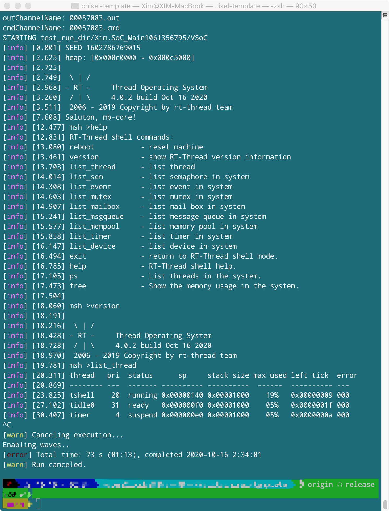

# Simple CPU

Once mb-core

## Goal

Build a RISC-V64 IMZicsr processor which is capable of running RT-thread.

## Structure

Two-stage pipeline (Instruction fetch and Execution)

## Logs：

### Done

2020.9.22 The very beginning instruction(addi x1, zero, 100)

2020.9.24 Branch instructions (beq zero, zero, 0x10)

2020.9.26 Introduced AXI RAM and build a simple SoC

2020.10.2 CSR related instructions

2020.10.3 Launch function tests

2020.10.6 risc-v test scripts，all RV32I tests pass

2020.10.15 RT-Thread without interrupts

2020.10.16 RT-Thread with interrupts

2020.10.26 branch predictor

2020.11.4 RV64IZicsr

2020.11.10 RTL freeze

### TODO

1. PTW

**Note that any branch other than `release` is not stable, functions may break without warning.**

## Run RT-Thread

### Preparation

1. Compile RT-thread with [RTT for mb-core](https://github.com/chenguokai/rtt-mbcore/tree/master/bsp/mb-core) .
2. Use `31.rtt.sh` in [tests](https://github.com/chenguokai/mbcore-tests) to generate bin file from `rtthread.elf`.
3. Adjust the load file path in AXI RAM file.

### Run

Call Type Three method in SoC_Main using sbt. `i` in which is the total expected instruction cycle.

## Test framework details

> Note that some paths are hard-coded, feel free to adjust if it does not fit yours.

### Type 1: any predicatable benchmark test

> No longer works like below since the simulator is for RV32I while we have moved to RV64I

程序正常执行甚至发生预期的异常时，几乎不会出现前后两条指令PC值一致的情形，如此一来判定指令前进变得异常简单，只需以相邻周期PC值是否有所改变作为新指令到来判据。
使用[isa_sim](https://github.com/ultraembedded/riscv/tree/master/isa_sim)
所提供的ISA模拟器，可导出benchmark执行trace，与上述指令判断依据结合即可实现指令比对。

### Type 2: risc-v test related auto test

All ISA tests from risc-v official repo will execute an `ecall` when pass or fail. Right before that, a passed test writes `1` to `a0` while a failed one writes `0`. Hence we are able to implement an auto test (`auto_test.py`).

### Type 3: any test without test feedback

Type 1 without trace comparison.

## Generate verilog

You may generate verilog for any non-BlackBox modules using their corresponding objects. To generate verilog for a BlackBox, use any module in which the BlackBox is used.